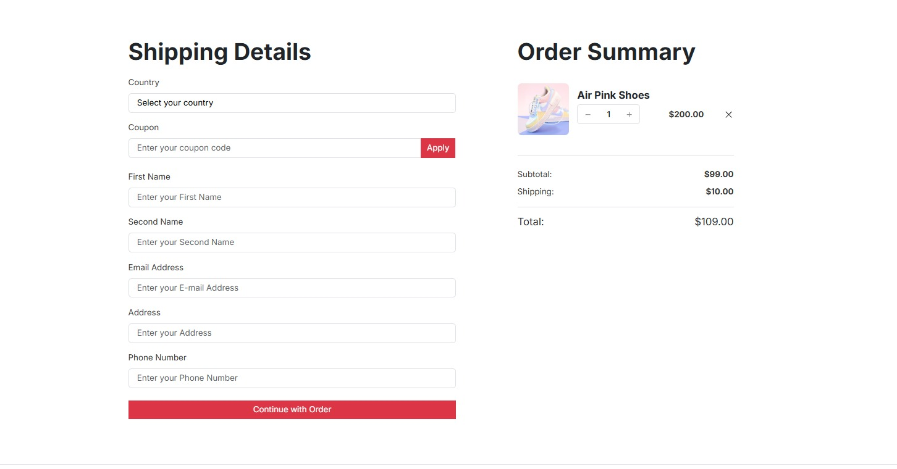
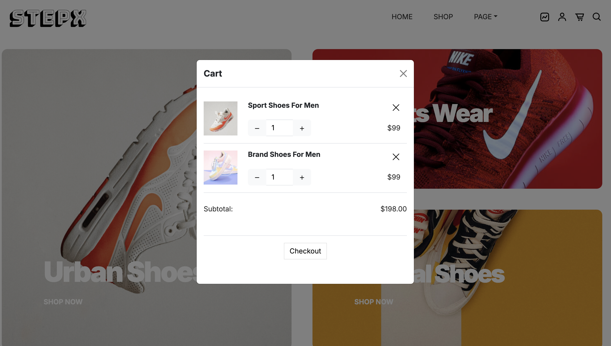
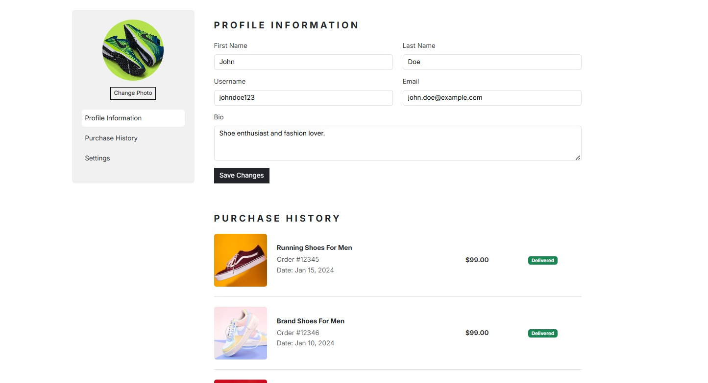
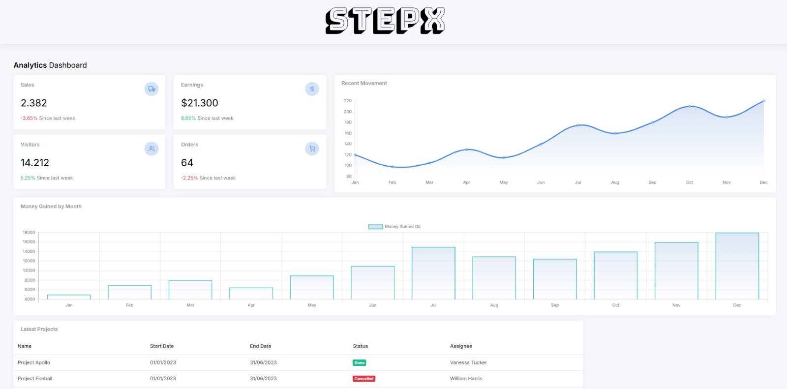
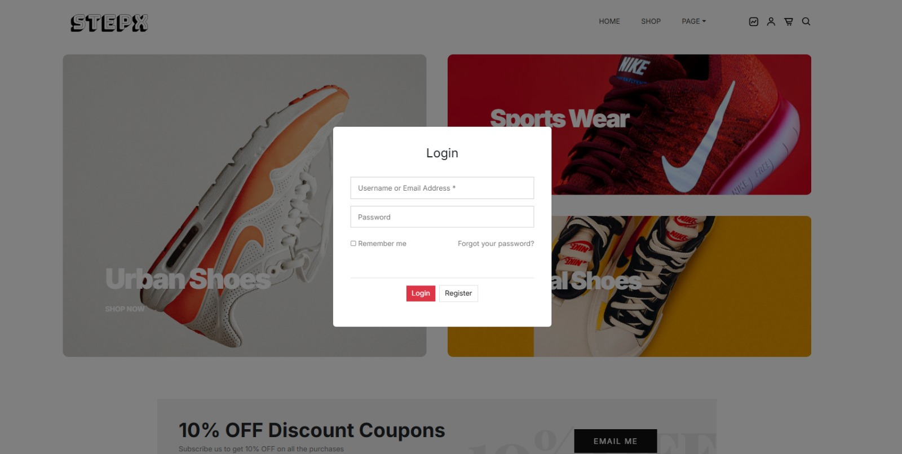
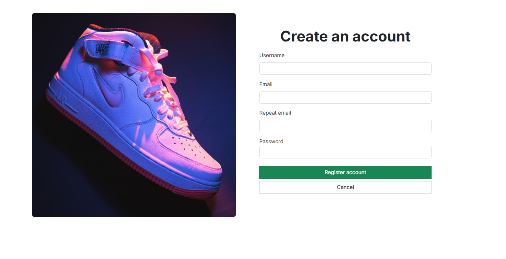

# WebApp15

# Phase 0
# Application Name: 👟 StepX

## 👥 Team Members:
| Name and surname    | URJC mail      | GitHub user      |
|:------------: |:------------:| :------------:|
| Gabriel Miro-Granada Lluch       | g.mirogranada.2022@alumnos.urjc.es       | Gabim23       |
| Elinee Nathalie Freites Muñoz       | en.freites.2022@alumnos.urjc.es       | ElineeF      |
| Ronald Sebastian Silvera Llimpe       | rs.silvera.2022@alumnos.urjc.es       | D4ng3r25       |
| Alexander Matias Pearson Huaycochea       | a.pearson.2022@alumnos.urjc.es       | Pearson33       |

## 🖼 Class Diagram
📌 *Visual representation of the system architecture:* 

## 🎭 **Theme & Description** 
A shoe ecommerce website where you can buy shoes, make reviews, ckeck your purchase history and apply coupons.

## 🚀 **Main Features** 
- User registration and authentication.
- Viewing the different shoes.
- Shoe purchase and coupon apply.
- Purchase history
- shopping cart
- Management and creation of products by the administrator.
- Uploading images for shoes from admin account.
- Uploading profile images from registered users account.
- Sales and attendance statistics.

## 🏗 **Entities**:
1. **User**: Information about registered users (username, email, password, avatar).
2. **Product**: Details of the shoes (id, size, genre, category, price, reviews).
3. **Order**: Information about orders (id, date, products bought).
4. **Coupon**: Details of the coupons (code, discount).
5. **Review**: User reviews about shoes (rating, description, user).
6. **History**: Where orders of every user are stored (orders).

## 🛠 User Types and Permissions:
- **Anonymous User**: Can view the shoes.
- **Registered User**: Can buy shoes, view purchase history, modify profile, make reviews.
- **Administrator**: Can create shoes, view sales statistics and delete products and reviews.

## 🏞 Images:
- Users can upload profile pictures.
- Shoes have pictures that are uploaded by the admin

## 📊 Charts:
- Sales statistics for admin (money)
- Number of products sold by date
- Money spent in shoes for registered users

## 💡 Complementary Technology:
- Users receive an email weekly with a coupon they can use in the shop.
- Users can download a pdf of the order. 

## ⭐ Advanced Algorithm or Query:
- **Recommendation System**: Based on past purchases, shoes are recommended to registered users

## 🏗 **Screens**:

### **Home Page**:
(agrega la descriocion de la pagina aqui )

### **otra pantalla**:
(agrega la descriocion de la pagina aqui )

### **otra pantalla**:
(agrega la descriocion de la pagina aqui )

### **otra pantalla**:
(agrega la descriocion de la pagina aqui )

### **otra pantalla**:
(agrega la descriocion de la pagina aqui )

### **Check-Out**:
The checkout screen allows users to complete their purchase by entering their shipping information, such as country, name, email, address and telephone, in addition to applying discount coupons. It also shows an order summary with product list, image, adjustable quantity, subtotal, shipping cost and automatically calculated total. Includes a "Continue with Order" button to complete the purchase. Its design is clear and functional, facilitating data validation and order adjustment in real time.

### **Cart**:
The cart screen shows a summary of the selected products, including name, image, adjustable quantity and price. It also calculates the subtotal and offers the "Checkout" option to proceed with the purchase, this makes it easier to manage the order before payment, and see what products the order contains.

### **Profile**:
This is the user profile screen for StepX website. Allows the user to view and edit their personal information, including first name, last name, username, email, and a short biography. It also offers the option to change the profile photo. At the bottom, the purchase history is displayed, where the user can see details of previous orders, such as the product name, order number, date, price and delivery status. The side navigation includes access to profile information, purchase history and settings, and at the end of this page there is a graph showing the spending in the store for each month.

### **Admin**:
This is the StepX admin panel screen. Displays an analytical summary with key metrics such as sales, profits, visitors and orders, along with their respective variations from the last week. It also includes trend graphs, such as recent sales movement and monthly profits, allowing managers to monitor business performance. The interface is visually clear, with a design focused on quick interpretation of data.

### **Login**:
This is the login screen for the StepX website. It presents a pop-up form where users can enter their username or email and password to access their account. It also offers options to remember the session and recover the password in case you forget. Additionally, it includes a registration button for new users.

### **Create Account**:
This is the create user account screen. It presents a form where users can enter their username, email, and select a password to create their account.

