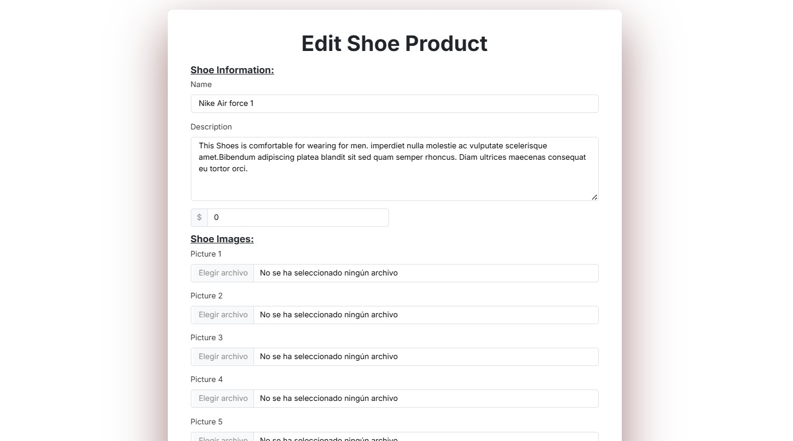
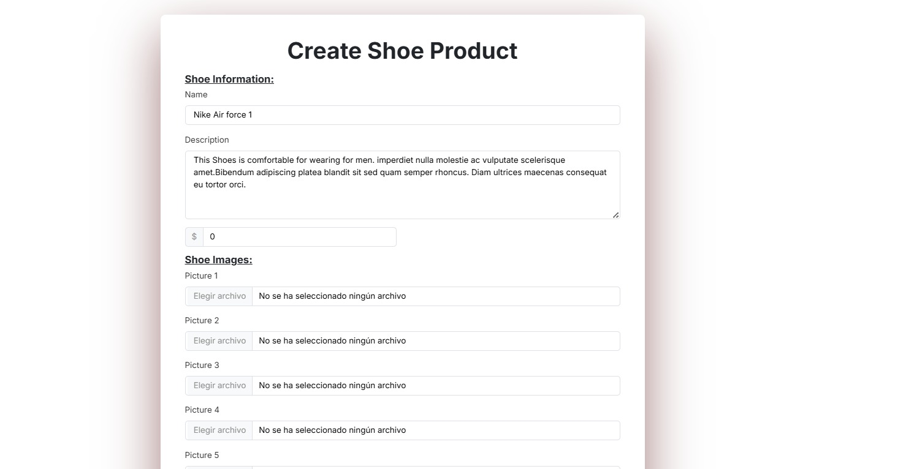

# WebApp15

# Phase 0
# Application Name: 👟 StepX

## 👥 Team Members:
| Name and surname    | URJC mail      | GitHub user      |
|:------------: |:------------:| :------------:|
| Gabriel Miro-Granada Lluch             | g.mirogranada.2022@alumnos.urjc.es    | Gabim23       |
| Elinee Nathalie Freites Muñoz          | en.freites.2022@alumnos.urjc.es       | ElineeF       |
| Ronald Sebastian Silvera Llimpe        | rs.silvera.2022@alumnos.urjc.es       | D4ng3r25      |
| Alexander Matias Pearson Huaycochea    | a.pearson.2022@alumnos.urjc.es        | Pearson33     |

## 🖼 Class Diagram
📌 *Visual representation of the system architecture:* 

## 🎭 **Theme & Description** 
A shoe ecommerce website where you can buy shoes, make reviews, ckeck your purchase history and apply coupons.

## 🚀 **Main Features** 
- User registration and authentication.
- Viewing the different shoes.
- Shoe purchase and coupon apply.
- Purchase history
- shopping cart
- Management and creation of products by the administrator.
- Uploading images for shoes from admin account.
- Uploading profile images from registered users account.
- Sales and attendance statistics.

## 🏗 **Entities**:
1. **User**: Information about registered users (username, email, password, avatar).
2. **Product**: Details of the shoes (id, size, genre, category, price, reviews).
3. **Order**: Information about orders (id, date, products bought).
4. **Coupon**: Details of the coupons (code, discount).
5. **Review**: User reviews about shoes (rating, description, user).
6. **History**: Where orders of every user are stored (orders).

## 🛠 User Types and Permissions:
- **Anonymous User**: Can view the shoes.
- **Registered User**: Can buy shoes, view purchase history, modify profile, make and delete reviews.
- **Administrator**: Can create shoes, view sales statistics, modify profile and delete products and reviews.

## 🏞 Images:
- Users and administrators can upload profile pictures.
- Shoes have pictures that are uploaded by the admin.

## 📊 Charts:
- Sales statistics for admin (money)
- Number of products sold by date
- Money spent in shoes for registered users

## 💡 Complementary Technology:
- Users receive a coupon by email when they sign up and click the button to receive the discount.
- Users can download a pdf of the order. 

## ⭐ Advanced Algorithm or Query:
- **Recommendation System**: Based on past purchases, shoes are recommended to registered users
- **Best Sellers System**: Based on all purchases made by all users, shoes are recommended to registered users
  
## 🏗 **Screens**:

### **Home Page**:
The home page tab is responsible for displaying what all new users can initially see, all users can see the variety ad the info of each product but the ones that are not registered can't purchase, the unregistered or anonymous ones can only have access to login or register button on the navbar, once the user is registered or authenticated it will have access to its own profile and their own cart. If the authenticated user is an admin then in the navbar will have access to general stadistics and their own profile. The navbar is regulated and shows especific buttons or icons depending on the type of user that access.

### **Indivivual Product Screen**:
Regarding the individual product screen, it displays the corresponding images of the selected product, as well as all its relevant attributes, including the button to select the shoe size and add it to the cart. At the bottom, there are comments about this product along with a more extensive description than the one above.

### **Shop Scren**:
The shop page is responsible for showcasing the available products, with the option for different types of customers to perform specific activities. Additionally, filters are available on the left side of the page. It has to be mentioned that is the user that acces is an admin, could delete, create, and edit each product in the shop page,but if the access is from a registered user, could only add it to cart. For each acces with or without ROLE, the quick view is gonna be available.

### **Edict Product Screen**:
The edit product tab is only available to administrator-type users. On this page, there is a form filled with the product's information (name, description, images, etc.).

### **Create Product Screen**:
Similarly to the edit item tab, the create item tab is available only to users who are administrators. This form contains the same fields as the form on the edit item tab. Both pages are accessed by clicking the respective buttons available within the shop.

### **Check-Out**:
The checkout screen allows users to complete their purchase by entering their shipping information, such as country, name, email, address and telephone, in addition to applying discount coupons. It also shows an order summary with product list, image, adjustable quantity, subtotal, shipping cost and automatically calculated total. Includes a "Continue with Order" button to complete the purchase. Its design is clear and functional, facilitating data validation and order adjustment in real time.

### **Cart**:
The cart screen shows a summary of the selected products, including name, image, adjustable quantity and price. It also calculates the subtotal and offers the "Checkout" option to proceed with the purchase, this makes it easier to manage the order before payment, and see what products the order contains.

### **User Profile**:
This is the user profile screen for StepX website. Allows the user to view and edit their personal information, including first name, last name, username, email, and a short biography. It also offers the option to change the profile photo. At the bottom, the purchase history is displayed, where the user can see details of previous orders, such as the product name, order number, date, price and delivery status. The side navigation includes access to profile information, purchase history and settings, and at the end of this page there is a graph showing the spending in the store for each month. If an admin access to its own profile, is going to see his profile picture, username and email only, the rest of attributes are reserved to users, also admins could access to shop for editing, creating or deleting and stadistics from their profile.

### **Admin**:
This is the StepX admin panel screen. Displays an analytical summary with key metrics such as sales, profits, visitors and orders, along with their respective variations from the last week. It also includes trend graphs, such as recent sales movement and monthly profits, allowing managers to monitor business performance. The interface is visually clear, with a design focused on quick interpretation of data.

### **Login**:
This is the login screen for the StepX website. It presents a pop-up form where users can enter their username or email and password to access their account. It validates if the data in the form are users that already been registered or not, it includes a registration button for new users in case it's the first time they access.

### **Create Account**:
This is the create user account screen. It presents a form where users can enter their username, email, and select a password to create their account.

## 💻 Screen Navigation Diagram:

### 📁 DIAGRAM WITH DATABASE ENTITIES

## 🤝 PARTICIPATION

### **Ronald Sebastian Silvera llimpe**
(Description)
| Nº    | Commits      | Files      |
|:------------: |:------------:| :------------:|
|1|   |   |
|2|   |   |
|3|   |   |
|4|   |   |
|5|   |   |

### **Alexander Matias Pearson Huaycochea**
(Description)
| Nº    | Commits      | Files      |
|:------------: |:------------:| :------------:|
|1|   |   |
|2|   |   |
|3|   |   |
|4|   |   |
|5|   |   |

### **Gabriel Miró-Granada Lluch**
Se ha encargado de:
- Todas las funciones del admin como crear producto, editar producto, eliminar producto
- La implementación del sistema de cupones
- La implementación de un sistema de correo que manda al usuario un cupón de descuento
- El panel del administrador con datos y gráficos
- Gráficas del perfil del usuario para ver sus gastos

| Nº    | Commits      | Files      |
|:------------: |:------------:| :------------:|
|1|   |   |
|2|   |   |
|3|   |   |
|4|   |   |
|5|   |   |

### **Elinee Nathalie Freites Muñoz**
(Description)
| Nº    | Commits      | Files      |
|:------------: |:------------:| :------------:|
|1|   |   |
|2|   |   |
|3|   |   |
|4|   |   |
|5|   |   |
