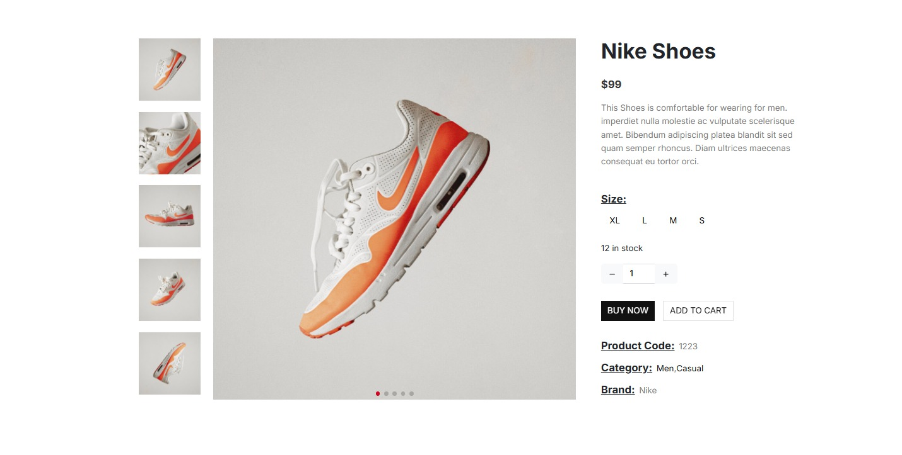
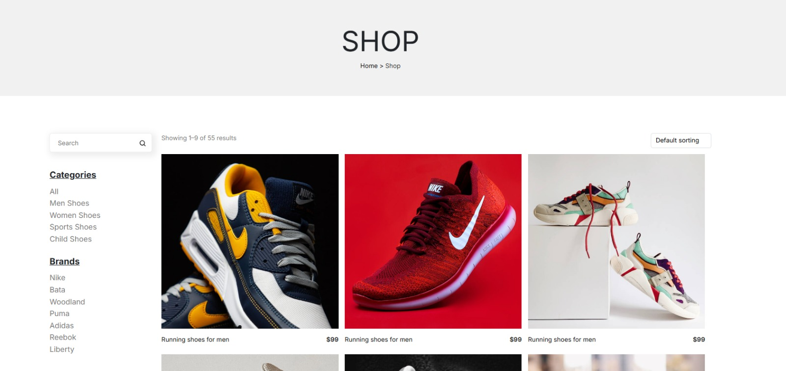

# WebApp15

# Phase 0
# Application Name: 👟 StepX

## 👥 Team Members:
| Name and surname    | URJC mail      | GitHub user      |
|:------------: |:------------:| :------------:|
| Gabriel Miro-Granada Lluch       | g.mirogranada.2022@alumnos.urjc.es       | Gabim23       |
| Elinee Nathalie Freites Muñoz       | en.freites.2022@alumnos.urjc.es       | ElineeF      |
| Ronald Sebastian Silvera Llimpe       | rs.silvera.2022@alumnos.urjc.es       | D4ng3r25       |
| Alexander Matias Pearson Huaycochea       | a.pearson.2022@alumnos.urjc.es       | Pearson33       |

## 🖼 Class Diagram
📌 *Visual representation of the system architecture:* 

## 🎭 **Theme & Description** 
A shoe ecommerce website where you can buy shoes, make reviews, ckeck your purchase history and apply coupons.

## 🚀 **Main Features** 
- User registration and authentication.
- Viewing the different shoes.
- Shoe purchase and coupon apply.
- Purchase history
- shopping cart
- Management and creation of products by the administrator.
- Uploading images for shoes from admin account.
- Uploading profile images from registered users account.
- Sales and attendance statistics.

## 🏗 **Entities**:
1. **User**: Information about registered users (username, email, password, avatar).
2. **Product**: Details of the shoes (id, size, genre, category, price, reviews).
3. **Order**: Information about orders (id, date, products bought).
4. **Coupon**: Details of the coupons (code, discount).
5. **Review**: User reviews about shoes (rating, description, user).
6. **History**: Where orders of every user are stored (orders).

## 🛠 User Types and Permissions:
- **Anonymous User**: Can view the shoes.
- **Registered User**: Can buy shoes, view purchase history, modify profile, make reviews.
- **Administrator**: Can create shoes, view sales statistics and delete products and reviews.

## 🏞 Images:
- Users can upload profile pictures.
- Shoes have pictures that are uploaded by the admin

## 📊 Charts:
- Sales statistics for admin (money)
- Number of products sold by date
- Money spent in shoes for registered users

## 💡 Complementary Technology:
- Users receive an email weekly with a coupon they can use in the shop.
- Users can download a pdf of the order. 

## ⭐ Advanced Algorithm or Query:
- **Recommendation System**: Based on past purchases, shoes are recommended to registered users

## 🏗 **Screens**:

### **Home Page**:
The home page tab is responsible for displaying what all new users can initially see, except for the section of the navigation bar where there are specific buttons that redirect to other tabs depending on the type of user detected by the system. It also allows you to navigate to other screens depending on the need.

### **Indivivual Product Screen**:
Regarding the individual product screen, it displays the corresponding images of the selected product, as well as all its relevant attributes, including the button to select the shoe size and add it to the cart. At the bottom, there are comments about this product along with a more extensive description than the one above.

### **Shop Scren**:
The shop page is responsible for showcasing the available products, with the option for different types of customers to perform specific activities. Additionally, filters are available on the left side of the page.

### **Edict Product Screen**:
The edit product tab is only available to administrator-type users. On this page, there is a form filled with the product's information (name, description, images, etc.).

### **Create Product Screen**:
Similarly to the edit item tab, the create item tab is available only to users who are administrators. This form contains the same fields as the form on the edit item tab. Both pages are accessed by clicking the respective buttons available within the shop.

### **otra pantalla**:
(agrega la descriocion de la pagina aqui )

### **otra pantalla**:
(agrega la descriocion de la pagina aqui )

### **otra pantalla**:
(agrega la descriocion de la pagina aqui )

### **otra pantalla**:
(agrega la descriocion de la pagina aqui )

### **otra pantalla**:
(agrega la descriocion de la pagina aqui )

### **otra pantalla**:
(agrega la descriocion de la pagina aqui )

## 💻 Screen Diagram:

